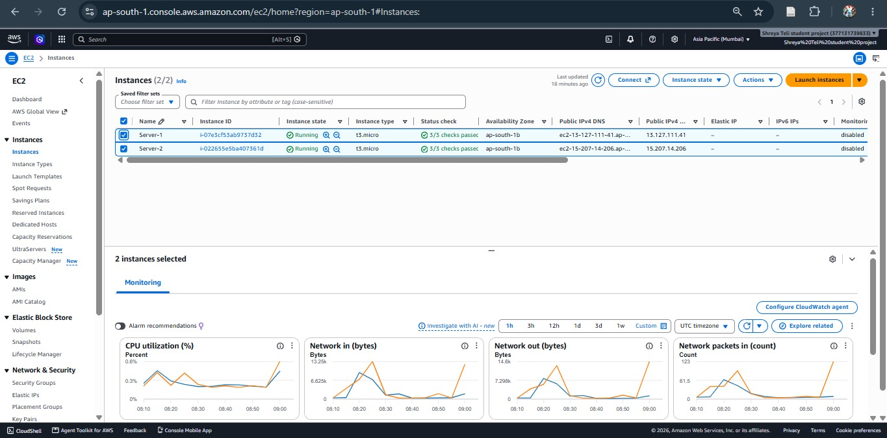
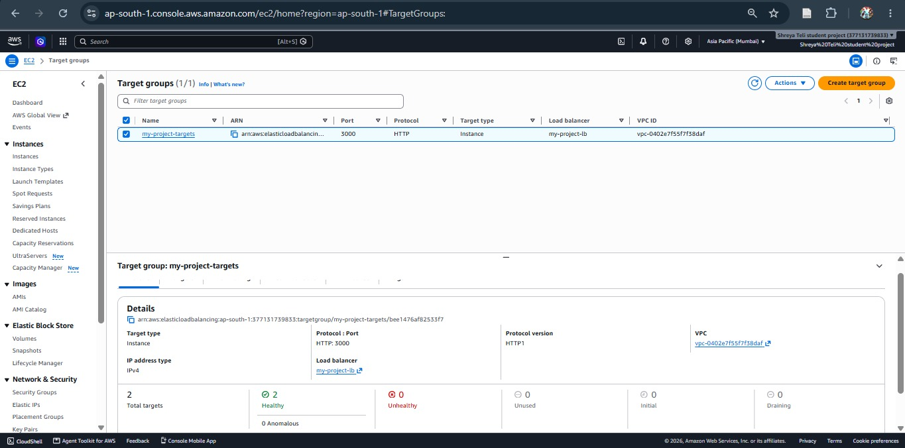
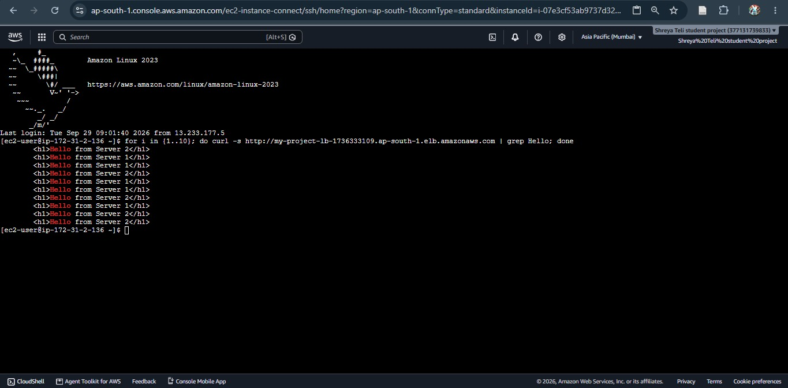
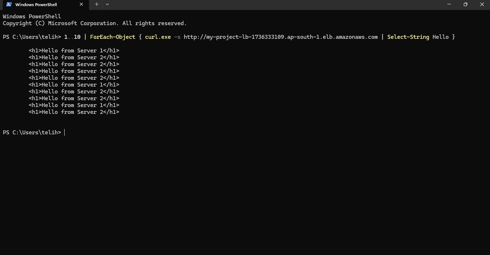
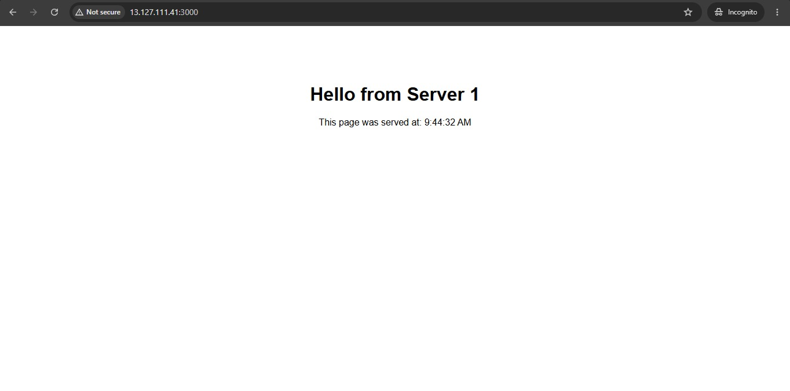
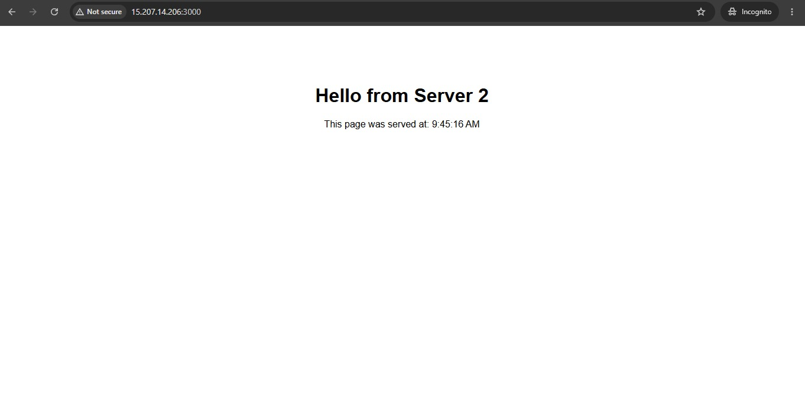
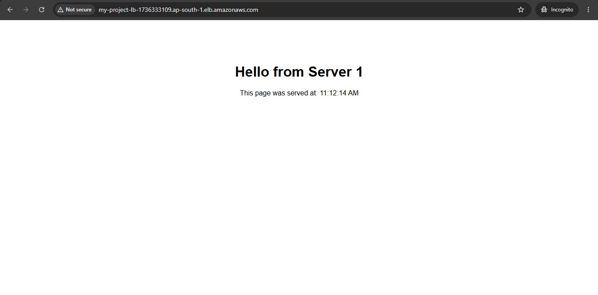
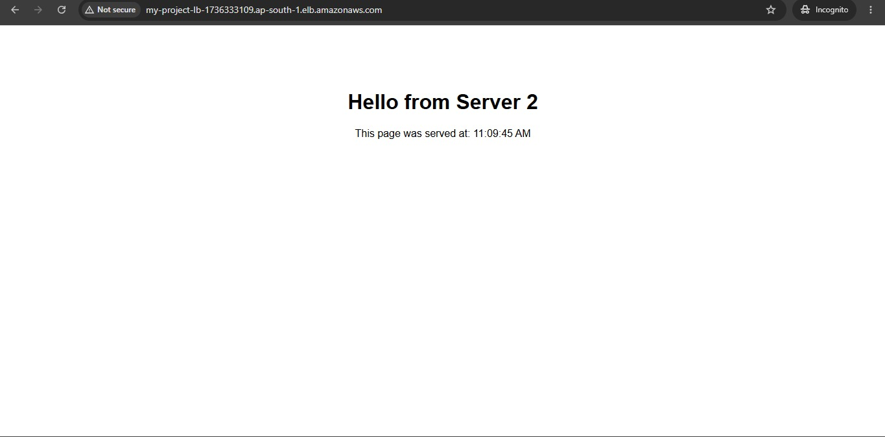

# Load-Balanced Web App on AWS EC2

A small web application deployed on **two AWS EC2 instances**, sitting behind
an **AWS Application Load Balancer**, to demonstrate horizontal scaling and
traffic distribution — a core pattern used by real-world production systems
to stay fast and reliable under load.

## What this project does

- A simple Node.js/Express app that displays which server answered the
  request (`Server 1` or `Server 2`)
- The exact same app runs on two separate EC2 instances
- An AWS Load Balancer sits in front of both servers and distributes
  incoming visitors between them
- If you refresh the page repeatedly, you'll see it alternate between
  `Server 1` and `Server 2` — proof that traffic is being split
- If one server goes down, the load balancer automatically stops sending
  traffic to it and routes everyone to the remaining healthy server

## Architecture

```
                          ┌───────────────┐
                          │    Visitor    │
                          └───────┬───────┘
                                  │
                                  ▼
                    ┌──────────────────────────┐
                    │   AWS Load Balancer       │
                    │  (splits incoming traffic) │
                    └─────────────┬──────────────┘
                                  │
                  ┌───────────────┴───────────────┐
                  ▼                                ▼
          ┌───────────────┐               ┌───────────────┐
          │   EC2 Server 1 │               │   EC2 Server 2 │
          │  (runs app.js) │               │  (runs app.js) │
          └───────────────┘               └───────────────┘
```

## Tech used

- **Node.js + Express** — the small web app itself
- **AWS EC2** — two virtual servers running the app
- **AWS Application Load Balancer (ALB)** — distributes traffic across
  both servers and health-checks them
- **Jest + Supertest** — automated tests for the app
- **GitHub Actions** — CI/CD pipeline that runs tests on every push and
  blocks the push if any test fails

## How to run it locally

```bash
# 1. Clone this repo
git clone https://github.com/<your-username>/load-balanced-web-app.git
cd load-balanced-web-app

# 2. Install dependencies
npm install

# 3. Run the app
npm start
# Visit http://localhost:3000

# 4. Run the tests
npm test
```

## How it was deployed on AWS

1. Launched two `t2.micro` EC2 instances (free-tier eligible)
2. Installed Node.js on each instance
3. Copied this project onto both instances
4. On Server 1, ran the app with `SERVER_NAME="Server 1"`
5. On Server 2, ran the app with `SERVER_NAME="Server 2"`
6. Created an AWS Application Load Balancer and registered both
   instances as targets
7. Pointed a browser at the load balancer's public address — refreshing
   the page shows requests alternating between both servers

## Testing & CI/CD

This repo uses **GitHub Actions** (see `.github/workflows/ci.yml`) to
automatically run 4 test cases on every push:

1. Homepage loads successfully (status 200)
2. Homepage contains a greeting message
3. Health check endpoint (`/health`) responds correctly
4. Unknown routes correctly return a 404

If any test fails, GitHub Actions marks the push as failed, preventing
broken code from being considered "working."

## Why this matters

This project demonstrates a core cloud computing concept: **no single
server should be a single point of failure**. By running the same app on
multiple servers behind a load balancer, the system can handle more
traffic and stay online even if one server fails — the same underlying
idea used by large-scale applications like Netflix, Instagram, and
Google to stay reliable for millions of users.

## Deployment on AWS

This app runs on 2 AWS EC2 servers (Server 1 and Server 2) behind an
Application Load Balancer, which shares incoming requests between them.

**Live URL:** http://my-project-lb-1736333109.ap-south-1.elb.amazonaws.com


### How I set it up
1. Launched 2 EC2 instances and ran the app on port 3000 on each
2. Created a target group with both servers
3. Created a load balancer that forwards traffic to the target group
4. Checked that both servers show as healthy

### Proof that load balancing works
I sent 10 requests to the load balancer. The responses came from both
Server 1 and Server 2, so the traffic is being shared.

### Screenshots

### Screenshots

**1. Both servers running on AWS**


**2. Load balancer sees both servers as healthy**


**3. Load balancing test from the AWS server**


**4. Same test from my laptop**


**5. Server 1 on its own**


**6. Server 2 on its own**


**7. Load balancer link in the browser, showing Server 1**


**8. Same link after refreshing, showing Server 2**

